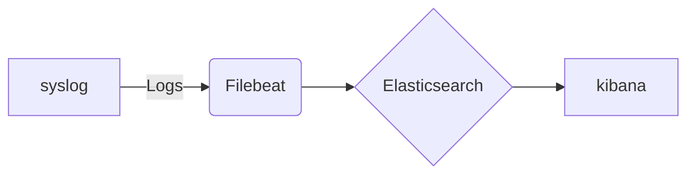

# Overview

Design and Implement a robust and scalable application platform for an organization that requires hosting multiple web applications with version control..

#  Tools & Technology used

 - [ ] Apache Tomcat
 - [ ] Postgres
 - [ ] Gitlab
 - [ ] Haproxy
 - [ ] Ansible
 - [ ] Prometheus
 - [ ] Grafana
 - [ ] Postgres-Exporter
 - [ ] Filebeat
 - [ ] Elasticsearch
 - [ ] Kibana

# Setup steps and Explaination
Note: Ansible and Docker has been already installed as a prerequisite for the setup.

##   Tomcat Installation:

Below is the ansible playbook to install and configure two tomcat instances in a single go.

```
---
- hosts: localhost
  become: yes
  tasks:
    - name: Create a directory for the first instance docroot
      file:
        path: /Project/docroot1
        state: directory

    - name: Create a directory for the second instance docroot
      file:
        path: /Project/docroot2
        state: directory

    - name: Copy the WAR file to the first instance docroot
      copy:
        src: /home/somesh/Documents/NEWSETUP/configs/newapp1.war
        dest: /Project/docroot1/newapp1.war

    - name: Copy the WAR file to the second instance docroot
      copy:
        src: /home/somesh/Documents/NEWSETUP/configs/newapp1.war
        dest: /Project/docroot2/newapp1.war

    - name: Create the first Tomcat container
      docker_container:
        name: tomcat-instance-1
        image: tomcat:10.1.0-jdk17
        ports:
          - "8081:8080"
        volumes:
          - /Project/docroot1:/usr/local/tomcat/webapps
          - /Project/all_logs/tomcat1/logs:/usr/local/tomcat/logs
        state: started
        restart_policy: always
        env:
          JAVA_OPTS: "-Djava.awt.headless=true"

    - name: Create the second Tomcat container
      docker_container:
        name: tomcat-instance-2
        image: tomcat:10.1.0-jdk17
        ports:
          - "8082:8080"
        volumes:
          - /Project/docroot2:/usr/local/tomcat/webapps
          - /Project/all_logs/tomcat2/logs:/usr/local/tomcat/logs
        state: started
        restart_policy: always
        env:
          JAVA_OPTS: "-Djava.awt.headless=true"

```

Execute the same using below command:

    ```ansible-playbook -i /etc/ansible/hosts tomcat_setup.yml
    ```   
----------------------------------------------------------------
# Postgres Master-slave Streaming Replication

##   Postgres Master setup:

Create a config file for postgres master setup:

```
listen_addresses = '*'
wal_level = replica
max_wal_senders = 3
wal_keep_size = 16MB

```
Then execuet the below playbook to setup master container using the config file:

```
---
- hosts: localhost
  become: yes
  tasks:

    - name: Create a directory for PostgreSQL master data
      file:
        path: /Project/postgres-master-data
        state: directory

    - name: Create network for PostgreSQL
      docker_network:
        name: postgres_network
        state: present

    - name: Start PostgreSQL master container
      docker_container:
        name: postgres-master
        image: postgres:16
        ports:
          - "5432:5432"
        volumes:
          - /Project/postgres-master-data:/var/lib/postgresql/data
        env:
          POSTGRES_USER: postgres
          POSTGRES_PASSWORD: redhat123
          POSTGRES_DB: postgres
        state: started
        restart_policy: always
        networks:
          - name: postgres_network

    - name: Copy postgresql.conf to master container
      template:
        src: /home/somesh/Documents/NEWSETUP/configs/postgresql.conf
        dest: /Project/postgres-master-data/postgresql.conf

        #    - name: Restart PostgreSQL master container to apply configuration
        #      docker_container:
        #        name: postgres-master
        #        state: restarted
    - name: Stop PostgreSQL master container
      docker_container:
        name: postgres-master
        state: stopped

    - name: Start PostgreSQL master container
      docker_container:
        name: postgres-master
        state: started

    - name: Create replication user
      community.docker.docker_container_exec:
        container: postgres-master
        command: psql -U postgres -c "CREATE USER replica REPLICATION LOGIN ENCRYPTED PASSWORD 'redhat';"

```


##   Postgres Slave setup:

Create the slave config file as slave.config
```
primary_conninfo = 'host=postgres-master port=5432 user=replica password=redhat'

```
Execute the playbook to create slave container.

```
---
- hosts: localhost
  become: yes
  tasks:

    - name: Create a directory for PostgreSQL slave data
      file:
        path: /Project/postgres-slave-data
        state: directory

    - name: Start PostgreSQL slave container
      docker_container:
        name: postgres-slave
        image: postgres:16
        ports:
          - "5433:5432"
        volumes:
          - /Project/postgres-slave-data:/var/lib/postgresql/data
        env:
          POSTGRES_USER: postgres
          POSTGRES_PASSWORD: redhat123
        state: started
        restart_policy: always
        networks:
          - name: postgres_network

    - name: Stop slave container to sync with master
      docker_container:
        name: postgres-slave
        state: stopped

    - name: Clean up old data
      shell: "rm -rf /Project/postgres-slave-data/*"

    - name: Copy data from master to slave
      shell: |
        docker run --rm \
        -v /Project/postgres-slave-data:/var/lib/postgresql/data \
        --network container:postgres-master \
        postgres:15 \
        bash -c "pg_basebackup -h 127.0.0.1 -U replica -D /var/lib/postgresql/data -Fp -Xs -P -R"

    - name: Copy recovery.conf to slave container
      template:
        src: /home/somesh/Documents/NEWSETUP/configs/slave.conf
        dest: /Project/postgres-slave-data/postgresql.auto.conf

    - name: Start PostgreSQL slave container
      docker_container:
        name: postgres-slave
        state: started

```
---------------------------------------------------------------------------------

##   Haproxy setup:

Create a config file integrating tomcat container IPs to the same and execute the plaubook mentioning the correct path for the config file.

### config file-
```
global
    log /dev/log local0
    log /dev/log local1 notice
    chroot /var/lib/haproxy
    stats socket /run/haproxy/admin.sock mode 660 level admin
    stats timeout 30s
    user haproxy
    group haproxy
    daemon

defaults
    log global
    option httplog
    option dontlognull
    timeout connect 5000
    timeout client  50000
    timeout server  50000
    errorfile 400 /etc/haproxy/errors/400.http
    errorfile 403 /etc/haproxy/errors/403.http
    errorfile 408 /etc/haproxy/errors/408.http
    errorfile 500 /etc/haproxy/errors/500.http
    errorfile 502 /etc/haproxy/errors/502.http
    errorfile 503 /etc/haproxy/errors/503.http
    errorfile 504 /etc/haproxy/errors/504.http

frontend http_front
    bind *:80
    default_backend http_back

backend http_back
    balance roundrobin
    server tomcat1 127.0.0.1:8081 check
    server tomcat2 127.0.0.1:8082 check


```
Below playbook will install the Haproxy including the above config file:

```
---
- hosts: localhost
  become: yes
  tasks:

    - name: Install HAProxy
      apt:
        name: haproxy
        state: present

    - name: Create HAProxy configuration file
      template:
        src: /home/somesh/Documents/NEWSETUP/configs/haproxy.cfg
        dest: /etc/haproxy/haproxy.cfg

    - name: Start and enable HAProxy service
      systemd:
        name: haproxy
        state: started
        enabled: yes

    - name: Restart HAProxy to apply the new configuration
      systemd:
        name: haproxy
        state: restarted

```
-------------------------------------------------------------------------------

##   Gitlab setup:
```
---
- hosts: localhost
  become: yes
  tasks:

    - name: Create a directory for GitLab configuration
      file:
        path: /Project/gitlab/config
        state: directory

    - name: Create a directory for GitLab data
      file:
        path: /Project/gitlab/data
        state: directory

    - name: Create a directory for GitLab logs
      file:
        path: /Project/gitlab/logs
        state: directory

    - name: Start GitLab container
      docker_container:
        name: gitlab
        image: gitlab/gitlab-ee:latest
        ports:
          - "8083:80"
          - "8443:443"
          - "2222:22"
        volumes:
          - /Project/gitlab/config:/etc/gitlab
          - /Project/gitlab/data:/var/opt/gitlab
          - /Project/gitlab/logs:/var/log/gitlab
        env:
          GITLAB_OMNIBUS_CONFIG: |
            external_url 'http://localhost:8083'
        state: started
        restart_policy: always

    - name: Configure GitLab with initial settings
      community.docker.docker_container_exec:
        container: gitlab
        command: gitlab-ctl reconfigure

```
-----------------------------------------------------------------------
##   Deployment setup:
```
---
- name: Deploy WAR to Tomcat
  hosts: localhost
  become: yes
  vars:
    git_username: "user1"
    git_password: "pass%40123"
    repo_name: "loginapp"
    git_dest: "/Project/cloned/"
    maven_home: "/usr/share/maven"
    tomcat_home: "/Project/docroot1"
    war_file_name: "loginapp-1.war"

  tasks:
    - name: Remove the existing repository directory if it exists
      file:
        path: "{{ git_dest }}/{{ repo_name }}"
        state: absent

    - name: Clone the Git repository
      git:
        repo: "http://{{ git_username }}:{{ git_password }}@gitlabip:8083/deploy/{{ repo_name }}.git"
        dest: "{{ git_dest }}/{{ repo_name }}"
        version: v1
      register: git_clone_result

    - name: Build the WAR file using Maven
      shell: |
        export MAVEN_HOME={{ maven_home }}
        cd {{ git_dest }}/{{ repo_name }}
        mvn clean package
      when: git_clone_result.changed
      args:
        chdir: "{{ git_dest }}"

    - name: Copy the WAR file to Tomcat webapps directory
      shell: cp {{ git_dest }}{{ repo_name }}/target/{{ war_file_name }} {{ tomcat_home }}/
```

-----------------------------------------------------------------------------------------------

# Monitoring solutions

## Prometheus Grafana Setup

Below is the docker compose file, create the same as docker-compose.yml to setup the prometheus grafana container:

```
version: '3'
services:
  prometheus:
    image: prom/prometheus
    container_name: prom
    volumes:
      - /Project/prometheus:/etc/prometheus
    ports:
      - 9090:9090
    restart: unless-stopped
    networks:
      - pg-network

  grafana:
    image: grafana/grafana
    container_name: grafana
    ports:
      - 3000:3000
    restart: unless-stopped
    environment:
      - GF_SECURITY_ADMIN_USER=admin
      - GF_SECURITY_ADMIN_PASSWORD=redhat123
    volumes:
      - /Project/grafana:/etc/grafana/provisioning/datasources
    networks:
      - pg-network

networks:
  pg-network:
    external: true
```

Now create the setup using below command:

docker compose up

### Metrics Collection using Postgres-Exporter:

Create a container and set the URI as below to gather metrics from Postgres conatiner

```
docker run --net=pg-network -p 9187:9187 --name pgexporter -e DATA_SOURCE_URI="postresip:5432/postgres?sslmode=disable" -e DATA_SOURCE_USER=postgres -e DATA_SOURCE_PASS=xxxxxxx quay.io/prometheuscommunity/postgres-exporter
```

Gather Metrics using below command:

```
curl "http://localhost:9187/metrics" | grep -v '^#'

Collected Scrapes are:
go_gc_duration_seconds{quantile="0.25"} 5.4824e-05
go_gc_duration_seconds{quantile="0.5"} 8.0863e-05
go_gc_duration_seconds{quantile="0.75"} 0.000136942
go_gc_duration_seconds{quantile="1"} 0.004647914
go_gc_duration_seconds_sum 1.6935197849999999
go_gc_duration_seconds_count 6933
go_goroutines 10
go_info{version="go1.21.3"} 1
go_memstats_alloc_bytes 1.991e+06
go_memstats_alloc_bytes_total 8.86798056e+09
go_memstats_buck_hash_sys_bytes 4658
go_memstats_frees_total 1.0255631e+08
go_memstats_gc_sys_bytes 3.926304e+06
go_memstats_heap_alloc_bytes 1.991e+06
go_memstats_heap_idle_bytes 8.052736e+06
go_memstats_heap_inuse_bytes 3.776512e+06
go_memstats_heap_objects 12866
go_memstats_heap_released_bytes 6.63552e+06
go_memstats_heap_sys_bytes 1.1829248e+07
go_memstats_last_gc_time_seconds 1.7247818758126218e+09
go_memstats_lookups_total 0
go_memstats_mallocs_total 1.02569176e+08
go_memstats_mcache_inuse_bytes 4800
go_memstats_mcache_sys_bytes 15600
go_memstats_mspan_inuse_bytes 100464
go_memstats_mspan_sys_bytes 130368
go_memstats_next_gc_bytes 4.194304e+06
go_memstats_other_sys_bytes 878222
go_memstats_stack_inuse_bytes 753664
go_memstats_stack_sys_bytes 753664
go_memstats_sys_bytes 1.7538064e+07
go_threads 9
pg_database_size_bytes{datname="mydb"} 7.504399e+06
pg_database_size_bytes{datname="postgres"} 7.664099e+06
pg_database_size_bytes{datname="template0"} 7.504399e+06
pg_database_size_bytes{datname="template1"} 7.729635e+06
pg_database_size_bytes{datname="test1"} 7.569935e+06
pg_exporter_last_scrape_duration_seconds 0.02835268
pg_exporter_last_scrape_error 0
pg_exporter_scrapes_total 6284
pg_locks_count{datname="mydb",mode="accessexclusivelock"} 0
pg_locks_count{datname="mydb",mode="accesssharelock"} 0
pg_locks_count{datname="mydb",mode="exclusivelock"} 0
pg_locks_count{datname="mydb",mode="rowexclusivelock"} 0
pg_locks_count{datname="mydb",mode="rowsharelock"} 0
pg_locks_count{datname="mydb",mode="sharelock"} 0
pg_locks_count{datname="mydb",mode="sharerowexclusivelock"} 0
pg_locks_count{datname="mydb",mode="shareupdateexclusivelock"} 0
pg_locks_count{datname="mydb",mode="sireadlock"} 0
pg_locks_count{datname="postgres",mode="accessexclusivelock"} 0
pg_locks_count{datname="postgres",mode="accesssharelock"} 1
pg_locks_count{datname="postgres",mode="exclusivelock"} 0
pg_locks_count{datname="postgres",mode="rowexclusivelock"} 0
pg_locks_count{datname="postgres",mode="rowsharelock"} 0
pg_locks_count{datname="postgres",mode="sharelock"} 0
pg_locks_count{datname="postgres",mode="sharerowexclusivelock"} 0
pg_locks_count{datname="postgres",mode="shareupdateexclusivelock"} 0
pg_locks_count{datname="postgres",mode="sireadlock"} 0
pg_locks_count{datname="template0",mode="accessexclusivelock"} 0
pg_locks_count{datname="template0",mode="accesssharelock"} 0
pg_locks_count{datname="template0",mode="exclusivelock"} 0
pg_locks_count{datname="template0",mode="rowexclusivelock"} 0
pg_locks_count{datname="template0",mode="rowsharelock"} 0
pg_locks_count{datname="template0",mode="sharelock"} 0
pg_locks_count{datname="template0",mode="sharerowexclusivelock"} 0
pg_locks_count{datname="template0",mode="shareupdateexclusivelock"} 0
pg_locks_count{datname="template0",mode="sireadlock"} 0
pg_locks_count{datname="template1",mode="accessexclusivelock"} 0
pg_locks_count{datname="template1",mode="accesssharelock"} 0
pg_locks_count{datname="template1",mode="exclusivelock"} 0
pg_locks_count{datname="template1",mode="rowexclusivelock"} 0
pg_locks_count{datname="template1",mode="rowsharelock"} 0
pg_locks_count{datname="template1",mode="sharelock"} 0
pg_locks_count{datname="template1",mode="sharerowexclusivelock"} 0
pg_locks_count{datname="template1",mode="shareupdateexclusivelock"} 0
pg_locks_count{datname="template1",mode="sireadlock"} 0
pg_locks_count{datname="test1",mode="accessexclusivelock"} 0
pg_locks_count{datname="test1",mode="accesssharelock"} 0
pg_locks_count{datname="test1",mode="exclusivelock"} 0
pg_locks_count{datname="test1",mode="rowexclusivelock"} 0
pg_locks_count{datname="test1",mode="rowsharelock"} 0
pg_locks_count{datname="test1",mode="sharelock"} 0
pg_locks_count{datname="test1",mode="sharerowexclusivelock"} 0
pg_locks_count{datname="test1",mode="shareupdateexclusivelock"} 0
pg_locks_count{datname="test1",mode="sireadlock"} 0
pg_replication_is_replica 0
pg_replication_lag_seconds 0
pg_scrape_collector_duration_seconds{collector="database"} 0.033636986
pg_scrape_collector_duration_seconds{collector="locks"} 0.026305779
pg_scrape_collector_duration_seconds{collector="replication"} 0.017683039
pg_scrape_collector_duration_seconds{collector="replication_slot"} 0.016925972
pg_scrape_collector_duration_seconds{collector="stat_bgwriter"} 0.02876174
pg_scrape_collector_duration_seconds{collector="stat_database"} 0.027618885
pg_scrape_collector_duration_seconds{collector="stat_user_tables"} 0.022038038
pg_scrape_collector_duration_seconds{collector="statio_user_tables"} 0.007771861
pg_scrape_collector_duration_seconds{collector="wal"} 0.028155956
pg_scrape_collector_success{collector="database"} 1
pg_scrape_collector_success{collector="locks"} 1
pg_scrape_collector_success{collector="replication"} 1
pg_scrape_collector_success{collector="replication_slot"} 1
pg_scrape_collector_success{collector="stat_bgwriter"} 1
pg_scrape_collector_success{collector="stat_database"} 1
pg_scrape_collector_success{collector="stat_user_tables"} 1
pg_scrape_collector_success{collector="statio_user_tables"} 1
pg_scrape_collector_success{collector="wal"} 1
pg_settings_allow_in_place_tablespaces{server="172.19.0.2:5432"} 0
pg_settings_allow_system_table_mods{server="172.19.0.2:5432"} 0
pg_settings_archive_timeout_seconds{server="172.19.0.2:5432"} 0
pg_settings_array_nulls{server="172.19.0.2:5432"} 1
pg_settings_authentication_timeout_seconds{server="172.19.0.2:5432"} 60
pg_settings_autovacuum{server="172.19.0.2:5432"} 1
pg_settings_autovacuum_analyze_scale_factor{server="172.19.0.2:5432"} 0.1
pg_settings_autovacuum_analyze_threshold{server="172.19.0.2:5432"} 50
pg_settings_autovacuum_freeze_max_age{server="172.19.0.2:5432"} 2e+08
pg_settings_autovacuum_max_workers{server="172.19.0.2:5432"} 3
pg_settings_autovacuum_multixact_freeze_max_age{server="172.19.0.2:5432"} 4e+08
pg_settings_autovacuum_naptime_seconds{server="172.19.0.2:5432"} 60
pg_settings_autovacuum_vacuum_cost_delay_seconds{server="172.19.0.2:5432"} 0.002
pg_settings_autovacuum_vacuum_cost_limit{server="172.19.0.2:5432"} -1
pg_settings_autovacuum_vacuum_insert_scale_factor{server="172.19.0.2:5432"} 0.2
pg_settings_autovacuum_vacuum_insert_threshold{server="172.19.0.2:5432"} 1000
pg_settings_autovacuum_vacuum_scale_factor{server="172.19.0.2:5432"} 0.2
pg_settings_autovacuum_vacuum_threshold{server="172.19.0.2:5432"} 50
pg_settings_autovacuum_work_mem_bytes{server="172.19.0.2:5432"} -1
pg_settings_backend_flush_after_bytes{server="172.19.0.2:5432"} 0
pg_settings_bgwriter_delay_seconds{server="172.19.0.2:5432"} 0.2
pg_settings_bgwriter_flush_after_bytes{server="172.19.0.2:5432"} 524288
pg_settings_bgwriter_lru_maxpages{server="172.19.0.2:5432"} 100
pg_settings_bgwriter_lru_multiplier{server="172.19.0.2:5432"} 2
pg_settings_block_size{server="172.19.0.2:5432"} 8192
pg_settings_bonjour{server="172.19.0.2:5432"} 0
pg_settings_check_function_bodies{server="172.19.0.2:5432"} 1
pg_settings_checkpoint_completion_target{server="172.19.0.2:5432"} 0.9
pg_settings_checkpoint_flush_after_bytes{server="172.19.0.2:5432"} 262144
pg_settings_checkpoint_timeout_seconds{server="172.19.0.2:5432"} 300
pg_settings_checkpoint_warning_seconds{server="172.19.0.2:5432"} 30
pg_settings_client_connection_check_interval_seconds{server="172.19.0.2:5432"} 0
pg_settings_commit_delay{server="172.19.0.2:5432"} 0
pg_settings_commit_siblings{server="172.19.0.2:5432"} 5
pg_settings_cpu_index_tuple_cost{server="172.19.0.2:5432"} 0.005
pg_settings_cpu_operator_cost{server="172.19.0.2:5432"} 0.0025
pg_settings_cpu_tuple_cost{server="172.19.0.2:5432"} 0.01
pg_settings_cursor_tuple_fraction{server="172.19.0.2:5432"} 0.1
pg_settings_data_checksums{server="172.19.0.2:5432"} 0
pg_settings_data_directory_mode{server="172.19.0.2:5432"} 700
pg_settings_data_sync_retry{server="172.19.0.2:5432"} 0
pg_settings_db_user_namespace{server="172.19.0.2:5432"} 0
pg_settings_deadlock_timeout_seconds{server="172.19.0.2:5432"} 1
pg_settings_debug_assertions{server="172.19.0.2:5432"} 0
pg_settings_debug_discard_caches{server="172.19.0.2:5432"} 0
pg_settings_debug_pretty_print{server="172.19.0.2:5432"} 1
pg_settings_debug_print_parse{server="172.19.0.2:5432"} 0
pg_settings_debug_print_plan{server="172.19.0.2:5432"} 0
pg_settings_debug_print_rewritten{server="172.19.0.2:5432"} 0
pg_settings_default_statistics_target{server="172.19.0.2:5432"} 100
pg_settings_default_transaction_deferrable{server="172.19.0.2:5432"} 0
pg_settings_default_transaction_read_only{server="172.19.0.2:5432"} 0
pg_settings_effective_cache_size_bytes{server="172.19.0.2:5432"} 4.294967296e+09
pg_settings_effective_io_concurrency{server="172.19.0.2:5432"} 1
pg_settings_enable_async_append{server="172.19.0.2:5432"} 1
pg_settings_enable_bitmapscan{server="172.19.0.2:5432"} 1
pg_settings_enable_gathermerge{server="172.19.0.2:5432"} 1
pg_settings_enable_hashagg{server="172.19.0.2:5432"} 1
pg_settings_enable_hashjoin{server="172.19.0.2:5432"} 1
pg_settings_enable_incremental_sort{server="172.19.0.2:5432"} 1
pg_settings_enable_indexonlyscan{server="172.19.0.2:5432"} 1
pg_settings_enable_indexscan{server="172.19.0.2:5432"} 1
pg_settings_enable_material{server="172.19.0.2:5432"} 1
pg_settings_enable_memoize{server="172.19.0.2:5432"} 1
pg_settings_enable_mergejoin{server="172.19.0.2:5432"} 1
pg_settings_enable_nestloop{server="172.19.0.2:5432"} 1
pg_settings_enable_parallel_append{server="172.19.0.2:5432"} 1
pg_settings_enable_parallel_hash{server="172.19.0.2:5432"} 1
pg_settings_enable_partition_pruning{server="172.19.0.2:5432"} 1
pg_settings_enable_partitionwise_aggregate{server="172.19.0.2:5432"} 0
pg_settings_enable_partitionwise_join{server="172.19.0.2:5432"} 0
pg_settings_enable_presorted_aggregate{server="172.19.0.2:5432"} 1
pg_settings_enable_seqscan{server="172.19.0.2:5432"} 1
pg_settings_enable_sort{server="172.19.0.2:5432"} 1
pg_settings_enable_tidscan{server="172.19.0.2:5432"} 1
pg_settings_escape_string_warning{server="172.19.0.2:5432"} 1
pg_settings_exit_on_error{server="172.19.0.2:5432"} 0
pg_settings_extra_float_digits{server="172.19.0.2:5432"} 2
pg_settings_from_collapse_limit{server="172.19.0.2:5432"} 8
pg_settings_fsync{server="172.19.0.2:5432"} 1
pg_settings_full_page_writes{server="172.19.0.2:5432"} 1
pg_settings_geqo{server="172.19.0.2:5432"} 1
pg_settings_geqo_effort{server="172.19.0.2:5432"} 5
pg_settings_geqo_generations{server="172.19.0.2:5432"} 0
pg_settings_geqo_pool_size{server="172.19.0.2:5432"} 0
pg_settings_geqo_seed{server="172.19.0.2:5432"} 0
pg_settings_geqo_selection_bias{server="172.19.0.2:5432"} 2
pg_settings_geqo_threshold{server="172.19.0.2:5432"} 12
pg_settings_gin_fuzzy_search_limit{server="172.19.0.2:5432"} 0
pg_settings_gin_pending_list_limit_bytes{server="172.19.0.2:5432"} 4.194304e+06
pg_settings_gss_accept_delegation{server="172.19.0.2:5432"} 0
pg_settings_hash_mem_multiplier{server="172.19.0.2:5432"} 2
pg_settings_hot_standby{server="172.19.0.2:5432"} 1
pg_settings_hot_standby_feedback{server="172.19.0.2:5432"} 0
pg_settings_huge_page_size_bytes{server="172.19.0.2:5432"} 0
pg_settings_idle_in_transaction_session_timeout_seconds{server="172.19.0.2:5432"} 0
pg_settings_idle_session_timeout_seconds{server="172.19.0.2:5432"} 0
pg_settings_ignore_checksum_failure{server="172.19.0.2:5432"} 0
pg_settings_ignore_invalid_pages{server="172.19.0.2:5432"} 0
pg_settings_ignore_system_indexes{server="172.19.0.2:5432"} 0
pg_settings_in_hot_standby{server="172.19.0.2:5432"} 0
pg_settings_integer_datetimes{server="172.19.0.2:5432"} 1
pg_settings_jit{server="172.19.0.2:5432"} 1
pg_settings_jit_above_cost{server="172.19.0.2:5432"} 100000
pg_settings_jit_debugging_support{server="172.19.0.2:5432"} 0
pg_settings_jit_dump_bitcode{server="172.19.0.2:5432"} 0
pg_settings_jit_expressions{server="172.19.0.2:5432"} 1
pg_settings_jit_inline_above_cost{server="172.19.0.2:5432"} 500000
pg_settings_jit_optimize_above_cost{server="172.19.0.2:5432"} 500000
pg_settings_jit_profiling_support{server="172.19.0.2:5432"} 0
pg_settings_jit_tuple_deforming{server="172.19.0.2:5432"} 1
pg_settings_join_collapse_limit{server="172.19.0.2:5432"} 8
pg_settings_krb_caseins_users{server="172.19.0.2:5432"} 0
pg_settings_lo_compat_privileges{server="172.19.0.2:5432"} 0
pg_settings_lock_timeout_seconds{server="172.19.0.2:5432"} 0
pg_settings_log_autovacuum_min_duration_seconds{server="172.19.0.2:5432"} 600
pg_settings_log_checkpoints{server="172.19.0.2:5432"} 1
pg_settings_log_connections{server="172.19.0.2:5432"} 0
pg_settings_log_disconnections{server="172.19.0.2:5432"} 0
pg_settings_log_duration{server="172.19.0.2:5432"} 0
pg_settings_log_executor_stats{server="172.19.0.2:5432"} 0
pg_settings_log_file_mode{server="172.19.0.2:5432"} 600
pg_settings_log_hostname{server="172.19.0.2:5432"} 0
pg_settings_log_lock_waits{server="172.19.0.2:5432"} 0
pg_settings_log_min_duration_sample_seconds{server="172.19.0.2:5432"} -1
pg_settings_log_min_duration_statement_seconds{server="172.19.0.2:5432"} -1
pg_settings_log_parameter_max_length_bytes{server="172.19.0.2:5432"} -1
pg_settings_log_parameter_max_length_on_error_bytes{server="172.19.0.2:5432"} 0
pg_settings_log_parser_stats{server="172.19.0.2:5432"} 0
pg_settings_log_planner_stats{server="172.19.0.2:5432"} 0
pg_settings_log_recovery_conflict_waits{server="172.19.0.2:5432"} 0
pg_settings_log_replication_commands{server="172.19.0.2:5432"} 0
pg_settings_log_rotation_age_seconds{server="172.19.0.2:5432"} 86400
pg_settings_log_rotation_size_bytes{server="172.19.0.2:5432"} 1.048576e+07
pg_settings_log_startup_progress_interval_seconds{server="172.19.0.2:5432"} 10
pg_settings_log_statement_sample_rate{server="172.19.0.2:5432"} 1
pg_settings_log_statement_stats{server="172.19.0.2:5432"} 0
pg_settings_log_temp_files_bytes{server="172.19.0.2:5432"} -1
pg_settings_log_transaction_sample_rate{server="172.19.0.2:5432"} 0
pg_settings_log_truncate_on_rotation{server="172.19.0.2:5432"} 0
pg_settings_logging_collector{server="172.19.0.2:5432"} 0
pg_settings_logical_decoding_work_mem_bytes{server="172.19.0.2:5432"} 6.7108864e+07
pg_settings_maintenance_io_concurrency{server="172.19.0.2:5432"} 10
pg_settings_maintenance_work_mem_bytes{server="172.19.0.2:5432"} 6.7108864e+07
pg_settings_max_connections{server="172.19.0.2:5432"} 100
pg_settings_max_files_per_process{server="172.19.0.2:5432"} 1000
pg_settings_max_function_args{server="172.19.0.2:5432"} 100
pg_settings_max_identifier_length{server="172.19.0.2:5432"} 63
pg_settings_max_index_keys{server="172.19.0.2:5432"} 32
pg_settings_max_locks_per_transaction{server="172.19.0.2:5432"} 64
pg_settings_max_logical_replication_workers{server="172.19.0.2:5432"} 4
pg_settings_max_parallel_apply_workers_per_subscription{server="172.19.0.2:5432"} 2
pg_settings_max_parallel_maintenance_workers{server="172.19.0.2:5432"} 2
pg_settings_max_parallel_workers{server="172.19.0.2:5432"} 8
pg_settings_max_parallel_workers_per_gather{server="172.19.0.2:5432"} 2
pg_settings_max_pred_locks_per_page{server="172.19.0.2:5432"} 2
pg_settings_max_pred_locks_per_relation{server="172.19.0.2:5432"} -2
pg_settings_max_pred_locks_per_transaction{server="172.19.0.2:5432"} 64
pg_settings_max_prepared_transactions{server="172.19.0.2:5432"} 0
pg_settings_max_replication_slots{server="172.19.0.2:5432"} 10
pg_settings_max_slot_wal_keep_size_bytes{server="172.19.0.2:5432"} -1
pg_settings_max_stack_depth_bytes{server="172.19.0.2:5432"} 2.097152e+06
100 88486    0 88486    0     0  1800k      0 --:--:-- --:--:-- --:--:-- 1800k
pg_settings_max_standby_archive_delay_seconds{server="172.19.0.2:5432"} 30
pg_settings_max_standby_streaming_delay_seconds{server="172.19.0.2:5432"} 30
pg_settings_max_sync_workers_per_subscription{server="172.19.0.2:5432"} 2
pg_settings_max_wal_senders{server="172.19.0.2:5432"} 3
pg_settings_max_wal_size_bytes{server="172.19.0.2:5432"} 1.073741824e+09
pg_settings_max_worker_processes{server="172.19.0.2:5432"} 8
pg_settings_min_dynamic_shared_memory_bytes{server="172.19.0.2:5432"} 0
pg_settings_min_parallel_index_scan_size_bytes{server="172.19.0.2:5432"} 524288
pg_settings_min_parallel_table_scan_size_bytes{server="172.19.0.2:5432"} 8.388608e+06
pg_settings_min_wal_size_bytes{server="172.19.0.2:5432"} 8.388608e+07
pg_settings_old_snapshot_threshold_seconds{server="172.19.0.2:5432"} -1
pg_settings_parallel_leader_participation{server="172.19.0.2:5432"} 1
pg_settings_parallel_setup_cost{server="172.19.0.2:5432"} 1000
pg_settings_parallel_tuple_cost{server="172.19.0.2:5432"} 0.1
pg_settings_port{server="172.19.0.2:5432"} 5432
pg_settings_post_auth_delay_seconds{server="172.19.0.2:5432"} 0
pg_settings_pre_auth_delay_seconds{server="172.19.0.2:5432"} 0
pg_settings_quote_all_identifiers{server="172.19.0.2:5432"} 0
pg_settings_random_page_cost{server="172.19.0.2:5432"} 4
pg_settings_recovery_min_apply_delay_seconds{server="172.19.0.2:5432"} 0
pg_settings_recovery_target_inclusive{server="172.19.0.2:5432"} 1
pg_settings_recursive_worktable_factor{server="172.19.0.2:5432"} 10
pg_settings_remove_temp_files_after_crash{server="172.19.0.2:5432"} 1
pg_settings_reserved_connections{server="172.19.0.2:5432"} 0
pg_settings_restart_after_crash{server="172.19.0.2:5432"} 1
pg_settings_row_security{server="172.19.0.2:5432"} 1
pg_settings_scram_iterations{server="172.19.0.2:5432"} 4096
pg_settings_segment_size_bytes{server="172.19.0.2:5432"} 1.073741824e+09
pg_settings_send_abort_for_crash{server="172.19.0.2:5432"} 0
pg_settings_send_abort_for_kill{server="172.19.0.2:5432"} 0
pg_settings_seq_page_cost{server="172.19.0.2:5432"} 1
pg_settings_server_version_num{server="172.19.0.2:5432"} 160004
pg_settings_shared_buffers_bytes{server="172.19.0.2:5432"} 1.34217728e+08
pg_settings_shared_memory_size_bytes{server="172.19.0.2:5432"} 1.49946368e+08
pg_settings_shared_memory_size_in_huge_pages{server="172.19.0.2:5432"} 72
pg_settings_ssl{server="172.19.0.2:5432"} 0
pg_settings_ssl_passphrase_command_supports_reload{server="172.19.0.2:5432"} 0
pg_settings_ssl_prefer_server_ciphers{server="172.19.0.2:5432"} 1
pg_settings_standard_conforming_strings{server="172.19.0.2:5432"} 1
pg_settings_statement_timeout_seconds{server="172.19.0.2:5432"} 0
pg_settings_superuser_reserved_connections{server="172.19.0.2:5432"} 3
pg_settings_synchronize_seqscans{server="172.19.0.2:5432"} 1
pg_settings_syslog_sequence_numbers{server="172.19.0.2:5432"} 1
pg_settings_syslog_split_messages{server="172.19.0.2:5432"} 1
pg_settings_tcp_keepalives_count{server="172.19.0.2:5432"} 9
pg_settings_tcp_keepalives_idle_seconds{server="172.19.0.2:5432"} 7200
pg_settings_tcp_keepalives_interval_seconds{server="172.19.0.2:5432"} 75
pg_settings_tcp_user_timeout_seconds{server="172.19.0.2:5432"} 0
pg_settings_temp_buffers_bytes{server="172.19.0.2:5432"} 8.388608e+06
pg_settings_temp_file_limit_bytes{server="172.19.0.2:5432"} -1
pg_settings_trace_notify{server="172.19.0.2:5432"} 0
pg_settings_trace_sort{server="172.19.0.2:5432"} 0
pg_settings_track_activities{server="172.19.0.2:5432"} 1
pg_settings_track_activity_query_size_bytes{server="172.19.0.2:5432"} 1024
pg_settings_track_commit_timestamp{server="172.19.0.2:5432"} 0
pg_settings_track_counts{server="172.19.0.2:5432"} 1
pg_settings_track_io_timing{server="172.19.0.2:5432"} 0
pg_settings_track_wal_io_timing{server="172.19.0.2:5432"} 0
pg_settings_transaction_deferrable{server="172.19.0.2:5432"} 0
pg_settings_transaction_read_only{server="172.19.0.2:5432"} 0
pg_settings_transform_null_equals{server="172.19.0.2:5432"} 0
pg_settings_unix_socket_permissions{server="172.19.0.2:5432"} 777
pg_settings_update_process_title{server="172.19.0.2:5432"} 1
pg_settings_vacuum_buffer_usage_limit_bytes{server="172.19.0.2:5432"} 262144
pg_settings_vacuum_cost_delay_seconds{server="172.19.0.2:5432"} 0
pg_settings_vacuum_cost_limit{server="172.19.0.2:5432"} 200
pg_settings_vacuum_cost_page_dirty{server="172.19.0.2:5432"} 20
pg_settings_vacuum_cost_page_hit{server="172.19.0.2:5432"} 1
pg_settings_vacuum_cost_page_miss{server="172.19.0.2:5432"} 2
pg_settings_vacuum_failsafe_age{server="172.19.0.2:5432"} 1.6e+09
pg_settings_vacuum_freeze_min_age{server="172.19.0.2:5432"} 5e+07
pg_settings_vacuum_freeze_table_age{server="172.19.0.2:5432"} 1.5e+08
pg_settings_vacuum_multixact_failsafe_age{server="172.19.0.2:5432"} 1.6e+09
pg_settings_vacuum_multixact_freeze_min_age{server="172.19.0.2:5432"} 5e+06
pg_settings_vacuum_multixact_freeze_table_age{server="172.19.0.2:5432"} 1.5e+08
pg_settings_wal_block_size{server="172.19.0.2:5432"} 8192
pg_settings_wal_buffers_bytes{server="172.19.0.2:5432"} 4.194304e+06
pg_settings_wal_decode_buffer_size_bytes{server="172.19.0.2:5432"} 524288
pg_settings_wal_init_zero{server="172.19.0.2:5432"} 1
pg_settings_wal_keep_size_bytes{server="172.19.0.2:5432"} 1.6777216e+07
pg_settings_wal_log_hints{server="172.19.0.2:5432"} 0
pg_settings_wal_receiver_create_temp_slot{server="172.19.0.2:5432"} 0
pg_settings_wal_receiver_status_interval_seconds{server="172.19.0.2:5432"} 10
pg_settings_wal_receiver_timeout_seconds{server="172.19.0.2:5432"} 60
pg_settings_wal_recycle{server="172.19.0.2:5432"} 1
pg_settings_wal_retrieve_retry_interval_seconds{server="172.19.0.2:5432"} 5
pg_settings_wal_segment_size_bytes{server="172.19.0.2:5432"} 1.6777216e+07
pg_settings_wal_sender_timeout_seconds{server="172.19.0.2:5432"} 60
pg_settings_wal_skip_threshold_bytes{server="172.19.0.2:5432"} 2.097152e+06
pg_settings_wal_writer_delay_seconds{server="172.19.0.2:5432"} 0.2
pg_settings_wal_writer_flush_after_bytes{server="172.19.0.2:5432"} 1.048576e+06
pg_settings_work_mem_bytes{server="172.19.0.2:5432"} 4.194304e+06
pg_settings_zero_damaged_pages{server="172.19.0.2:5432"} 0
pg_stat_activity_count{application_name="",datname="mydb",server="172.19.0.2:5432",state="active",usename=""} 0
pg_stat_activity_count{application_name="",datname="mydb",server="172.19.0.2:5432",state="disabled",usename=""} 0
pg_stat_activity_count{application_name="",datname="mydb",server="172.19.0.2:5432",state="fastpath function call",usename=""} 0
pg_stat_activity_count{application_name="",datname="mydb",server="172.19.0.2:5432",state="idle",usename=""} 0
pg_stat_activity_count{application_name="",datname="mydb",server="172.19.0.2:5432",state="idle in transaction",usename=""} 0
pg_stat_activity_count{application_name="",datname="mydb",server="172.19.0.2:5432",state="idle in transaction (aborted)",usename=""} 0
pg_stat_activity_count{application_name="",datname="postgres",server="172.19.0.2:5432",state="active",usename="postgres"} 2
pg_stat_activity_count{application_name="",datname="postgres",server="172.19.0.2:5432",state="disabled",usename=""} 0
pg_stat_activity_count{application_name="",datname="postgres",server="172.19.0.2:5432",state="fastpath function call",usename=""} 0
pg_stat_activity_count{application_name="",datname="postgres",server="172.19.0.2:5432",state="idle",usename=""} 0
pg_stat_activity_count{application_name="",datname="postgres",server="172.19.0.2:5432",state="idle in transaction",usename=""} 0
pg_stat_activity_count{application_name="",datname="postgres",server="172.19.0.2:5432",state="idle in transaction (aborted)",usename=""} 0
pg_stat_activity_count{application_name="",datname="template0",server="172.19.0.2:5432",state="active",usename=""} 0
pg_stat_activity_count{application_name="",datname="template0",server="172.19.0.2:5432",state="disabled",usename=""} 0
pg_stat_activity_count{application_name="",datname="template0",server="172.19.0.2:5432",state="fastpath function call",usename=""} 0
pg_stat_activity_count{application_name="",datname="template0",server="172.19.0.2:5432",state="idle",usename=""} 0
pg_stat_activity_count{application_name="",datname="template0",server="172.19.0.2:5432",state="idle in transaction",usename=""} 0
pg_stat_activity_count{application_name="",datname="template0",server="172.19.0.2:5432",state="idle in transaction (aborted)",usename=""} 0
pg_stat_activity_count{application_name="",datname="template1",server="172.19.0.2:5432",state="active",usename=""} 0
pg_stat_activity_count{application_name="",datname="template1",server="172.19.0.2:5432",state="disabled",usename=""} 0
pg_stat_activity_count{application_name="",datname="template1",server="172.19.0.2:5432",state="fastpath function call",usename=""} 0
pg_stat_activity_count{application_name="",datname="template1",server="172.19.0.2:5432",state="idle",usename=""} 0
pg_stat_activity_count{application_name="",datname="template1",server="172.19.0.2:5432",state="idle in transaction",usename=""} 0
pg_stat_activity_count{application_name="",datname="template1",server="172.19.0.2:5432",state="idle in transaction (aborted)",usename=""} 0
pg_stat_activity_count{application_name="",datname="test1",server="172.19.0.2:5432",state="active",usename=""} 0
pg_stat_activity_count{application_name="",datname="test1",server="172.19.0.2:5432",state="disabled",usename=""} 0
pg_stat_activity_count{application_name="",datname="test1",server="172.19.0.2:5432",state="fastpath function call",usename=""} 0
pg_stat_activity_count{application_name="",datname="test1",server="172.19.0.2:5432",state="idle",usename=""} 0
pg_stat_activity_count{application_name="",datname="test1",server="172.19.0.2:5432",state="idle in transaction",usename=""} 0
pg_stat_activity_count{application_name="",datname="test1",server="172.19.0.2:5432",state="idle in transaction (aborted)",usename=""} 0
pg_stat_activity_max_tx_duration{application_name="",datname="mydb",server="172.19.0.2:5432",state="active",usename=""} 0
pg_stat_activity_max_tx_duration{application_name="",datname="mydb",server="172.19.0.2:5432",state="disabled",usename=""} 0
pg_stat_activity_max_tx_duration{application_name="",datname="mydb",server="172.19.0.2:5432",state="fastpath function call",usename=""} 0
pg_stat_activity_max_tx_duration{application_name="",datname="mydb",server="172.19.0.2:5432",state="idle",usename=""} 0
pg_stat_activity_max_tx_duration{application_name="",datname="mydb",server="172.19.0.2:5432",state="idle in transaction",usename=""} 0
pg_stat_activity_max_tx_duration{application_name="",datname="mydb",server="172.19.0.2:5432",state="idle in transaction (aborted)",usename=""} 0
pg_stat_activity_max_tx_duration{application_name="",datname="postgres",server="172.19.0.2:5432",state="active",usename="postgres"} 0
pg_stat_activity_max_tx_duration{application_name="",datname="postgres",server="172.19.0.2:5432",state="disabled",usename=""} 0
pg_stat_activity_max_tx_duration{application_name="",datname="postgres",server="172.19.0.2:5432",state="fastpath function call",usename=""} 0
pg_stat_activity_max_tx_duration{application_name="",datname="postgres",server="172.19.0.2:5432",state="idle",usename=""} 0
pg_stat_activity_max_tx_duration{application_name="",datname="postgres",server="172.19.0.2:5432",state="idle in transaction",usename=""} 0
pg_stat_activity_max_tx_duration{application_name="",datname="postgres",server="172.19.0.2:5432",state="idle in transaction (aborted)",usename=""} 0
pg_stat_activity_max_tx_duration{application_name="",datname="template0",server="172.19.0.2:5432",state="active",usename=""} 0
pg_stat_activity_max_tx_duration{application_name="",datname="template0",server="172.19.0.2:5432",state="disabled",usename=""} 0
pg_stat_activity_max_tx_duration{application_name="",datname="template0",server="172.19.0.2:5432",state="fastpath function call",usename=""} 0
pg_stat_activity_max_tx_duration{application_name="",datname="template0",server="172.19.0.2:5432",state="idle",usename=""} 0
pg_stat_activity_max_tx_duration{application_name="",datname="template0",server="172.19.0.2:5432",state="idle in transaction",usename=""} 0
pg_stat_activity_max_tx_duration{application_name="",datname="template0",server="172.19.0.2:5432",state="idle in transaction (aborted)",usename=""} 0
pg_stat_activity_max_tx_duration{application_name="",datname="template1",server="172.19.0.2:5432",state="active",usename=""} 0
pg_stat_activity_max_tx_duration{application_name="",datname="template1",server="172.19.0.2:5432",state="disabled",usename=""} 0
pg_stat_activity_max_tx_duration{application_name="",datname="template1",server="172.19.0.2:5432",state="fastpath function call",usename=""} 0
pg_stat_activity_max_tx_duration{application_name="",datname="template1",server="172.19.0.2:5432",state="idle",usename=""} 0
pg_stat_activity_max_tx_duration{application_name="",datname="template1",server="172.19.0.2:5432",state="idle in transaction",usename=""} 0
pg_stat_activity_max_tx_duration{application_name="",datname="template1",server="172.19.0.2:5432",state="idle in transaction (aborted)",usename=""} 0
pg_stat_activity_max_tx_duration{application_name="",datname="test1",server="172.19.0.2:5432",state="active",usename=""} 0
pg_stat_activity_max_tx_duration{application_name="",datname="test1",server="172.19.0.2:5432",state="disabled",usename=""} 0
pg_stat_activity_max_tx_duration{application_name="",datname="test1",server="172.19.0.2:5432",state="fastpath function call",usename=""} 0
pg_stat_activity_max_tx_duration{application_name="",datname="test1",server="172.19.0.2:5432",state="idle",usename=""} 0
pg_stat_activity_max_tx_duration{application_name="",datname="test1",server="172.19.0.2:5432",state="idle in transaction",usename=""} 0
pg_stat_activity_max_tx_duration{application_name="",datname="test1",server="172.19.0.2:5432",state="idle in transaction (aborted)",usename=""} 0
pg_stat_archiver_archived_count{server="172.19.0.2:5432"} 0
pg_stat_archiver_failed_count{server="172.19.0.2:5432"} 0
pg_stat_archiver_last_archive_age{server="172.19.0.2:5432"} NaN
pg_stat_bgwriter_buffers_alloc_total 2574
pg_stat_bgwriter_buffers_backend_fsync_total 0
pg_stat_bgwriter_buffers_backend_total 600
pg_stat_bgwriter_buffers_checkpoint_total 1892
pg_stat_bgwriter_buffers_clean_total 0
pg_stat_bgwriter_checkpoint_sync_time_total 46
pg_stat_bgwriter_checkpoint_write_time_total 97545
pg_stat_bgwriter_checkpoints_req_total 4
pg_stat_bgwriter_checkpoints_timed_total 348
pg_stat_bgwriter_maxwritten_clean_total 0
pg_stat_bgwriter_stats_reset_total 1.724434125e+09
pg_stat_database_blk_read_time{datid="1",datname="template1"} 0
pg_stat_database_blk_read_time{datid="16384",datname="mydb"} 0
pg_stat_database_blk_read_time{datid="16390",datname="test1"} 0
pg_stat_database_blk_read_time{datid="4",datname="template0"} 0
pg_stat_database_blk_read_time{datid="5",datname="postgres"} 0
pg_stat_database_blk_write_time{datid="1",datname="template1"} 0
pg_stat_database_blk_write_time{datid="16384",datname="mydb"} 0
pg_stat_database_blk_write_time{datid="16390",datname="test1"} 0
pg_stat_database_blk_write_time{datid="4",datname="template0"} 0
pg_stat_database_blk_write_time{datid="5",datname="postgres"} 0
pg_stat_database_blks_hit{datid="1",datname="template1"} 219161
pg_stat_database_blks_hit{datid="16384",datname="mydb"} 0
pg_stat_database_blks_hit{datid="16390",datname="test1"} 0
pg_stat_database_blks_hit{datid="4",datname="template0"} 0
pg_stat_database_blks_hit{datid="5",datname="postgres"} 9.763337e+06
pg_stat_database_blks_read{datid="1",datname="template1"} 892
pg_stat_database_blks_read{datid="16384",datname="mydb"} 0
pg_stat_database_blks_read{datid="16390",datname="test1"} 0
pg_stat_database_blks_read{datid="4",datname="template0"} 0
pg_stat_database_blks_read{datid="5",datname="postgres"} 577
pg_stat_database_conflicts{datid="1",datname="template1"} 0
pg_stat_database_conflicts{datid="16384",datname="mydb"} 0
pg_stat_database_conflicts{datid="16390",datname="test1"} 0
pg_stat_database_conflicts{datid="4",datname="template0"} 0
pg_stat_database_conflicts{datid="5",datname="postgres"} 0
pg_stat_database_conflicts_confl_active_logicalslot{datid="1",datname="template1",server="172.19.0.2:5432"} 0
pg_stat_database_conflicts_confl_active_logicalslot{datid="16384",datname="mydb",server="172.19.0.2:5432"} 0
pg_stat_database_conflicts_confl_active_logicalslot{datid="16390",datname="test1",server="172.19.0.2:5432"} 0
pg_stat_database_conflicts_confl_active_logicalslot{datid="4",datname="template0",server="172.19.0.2:5432"} 0
pg_stat_database_conflicts_confl_active_logicalslot{datid="5",datname="postgres",server="172.19.0.2:5432"} 0
pg_stat_database_conflicts_confl_bufferpin{datid="1",datname="template1",server="172.19.0.2:5432"} 0
pg_stat_database_conflicts_confl_bufferpin{datid="16384",datname="mydb",server="172.19.0.2:5432"} 0
pg_stat_database_conflicts_confl_bufferpin{datid="16390",datname="test1",server="172.19.0.2:5432"} 0
pg_stat_database_conflicts_confl_bufferpin{datid="4",datname="template0",server="172.19.0.2:5432"} 0
pg_stat_database_conflicts_confl_bufferpin{datid="5",datname="postgres",server="172.19.0.2:5432"} 0
pg_stat_database_conflicts_confl_deadlock{datid="1",datname="template1",server="172.19.0.2:5432"} 0
pg_stat_database_conflicts_confl_deadlock{datid="16384",datname="mydb",server="172.19.0.2:5432"} 0
pg_stat_database_conflicts_confl_deadlock{datid="16390",datname="test1",server="172.19.0.2:5432"} 0
pg_stat_database_conflicts_confl_deadlock{datid="4",datname="template0",server="172.19.0.2:5432"} 0
pg_stat_database_conflicts_confl_deadlock{datid="5",datname="postgres",server="172.19.0.2:5432"} 0
pg_stat_database_conflicts_confl_lock{datid="1",datname="template1",server="172.19.0.2:5432"} 0
pg_stat_database_conflicts_confl_lock{datid="16384",datname="mydb",server="172.19.0.2:5432"} 0
pg_stat_database_conflicts_confl_lock{datid="16390",datname="test1",server="172.19.0.2:5432"} 0
pg_stat_database_conflicts_confl_lock{datid="4",datname="template0",server="172.19.0.2:5432"} 0
pg_stat_database_conflicts_confl_lock{datid="5",datname="postgres",server="172.19.0.2:5432"} 0
pg_stat_database_conflicts_confl_snapshot{datid="1",datname="template1",server="172.19.0.2:5432"} 0
pg_stat_database_conflicts_confl_snapshot{datid="16384",datname="mydb",server="172.19.0.2:5432"} 0
pg_stat_database_conflicts_confl_snapshot{datid="16390",datname="test1",server="172.19.0.2:5432"} 0
pg_stat_database_conflicts_confl_snapshot{datid="4",datname="template0",server="172.19.0.2:5432"} 0
pg_stat_database_conflicts_confl_snapshot{datid="5",datname="postgres",server="172.19.0.2:5432"} 0
pg_stat_database_conflicts_confl_tablespace{datid="1",datname="template1",server="172.19.0.2:5432"} 0
pg_stat_database_conflicts_confl_tablespace{datid="16384",datname="mydb",server="172.19.0.2:5432"} 0
pg_stat_database_conflicts_confl_tablespace{datid="16390",datname="test1",server="172.19.0.2:5432"} 0
pg_stat_database_conflicts_confl_tablespace{datid="4",datname="template0",server="172.19.0.2:5432"} 0
pg_stat_database_conflicts_confl_tablespace{datid="5",datname="postgres",server="172.19.0.2:5432"} 0
pg_stat_database_deadlocks{datid="1",datname="template1"} 0
pg_stat_database_deadlocks{datid="16384",datname="mydb"} 0
pg_stat_database_deadlocks{datid="16390",datname="test1"} 0
pg_stat_database_deadlocks{datid="4",datname="template0"} 0
pg_stat_database_deadlocks{datid="5",datname="postgres"} 0
pg_stat_database_numbackends{datid="1",datname="template1"} 0
pg_stat_database_numbackends{datid="16384",datname="mydb"} 0
pg_stat_database_numbackends{datid="16390",datname="test1"} 0
pg_stat_database_numbackends{datid="4",datname="template0"} 0
pg_stat_database_numbackends{datid="5",datname="postgres"} 2
pg_stat_database_stats_reset{datid="1",datname="template1"} 0
pg_stat_database_stats_reset{datid="16384",datname="mydb"} 0
pg_stat_database_stats_reset{datid="16390",datname="test1"} 0
pg_stat_database_stats_reset{datid="4",datname="template0"} 0
pg_stat_database_stats_reset{datid="5",datname="postgres"} 0
pg_stat_database_temp_bytes{datid="1",datname="template1"} 0
pg_stat_database_temp_bytes{datid="16384",datname="mydb"} 0
pg_stat_database_temp_bytes{datid="16390",datname="test1"} 0
pg_stat_database_temp_bytes{datid="4",datname="template0"} 0
pg_stat_database_temp_bytes{datid="5",datname="postgres"} 0
pg_stat_database_temp_files{datid="1",datname="template1"} 0
pg_stat_database_temp_files{datid="16384",datname="mydb"} 0
pg_stat_database_temp_files{datid="16390",datname="test1"} 0
pg_stat_database_temp_files{datid="4",datname="template0"} 0
pg_stat_database_temp_files{datid="5",datname="postgres"} 0
pg_stat_database_tup_deleted{datid="1",datname="template1"} 34
pg_stat_database_tup_deleted{datid="16384",datname="mydb"} 0
pg_stat_database_tup_deleted{datid="16390",datname="test1"} 0
pg_stat_database_tup_deleted{datid="4",datname="template0"} 0
pg_stat_database_tup_deleted{datid="5",datname="postgres"} 0
pg_stat_database_tup_fetched{datid="1",datname="template1"} 52201
pg_stat_database_tup_fetched{datid="16384",datname="mydb"} 0
pg_stat_database_tup_fetched{datid="16390",datname="test1"} 0
pg_stat_database_tup_fetched{datid="4",datname="template0"} 0
pg_stat_database_tup_fetched{datid="5",datname="postgres"} 6.005932e+06
pg_stat_database_tup_inserted{datid="1",datname="template1"} 17616
pg_stat_database_tup_inserted{datid="16384",datname="mydb"} 0
pg_stat_database_tup_inserted{datid="16390",datname="test1"} 0
pg_stat_database_tup_inserted{datid="4",datname="template0"} 0
pg_stat_database_tup_inserted{datid="5",datname="postgres"} 0
pg_stat_database_tup_returned{datid="1",datname="template1"} 1.616427e+06
pg_stat_database_tup_returned{datid="16384",datname="mydb"} 0
pg_stat_database_tup_returned{datid="16390",datname="test1"} 0
pg_stat_database_tup_returned{datid="4",datname="template0"} 0
pg_stat_database_tup_returned{datid="5",datname="postgres"} 1.2827102e+07
pg_stat_database_tup_updated{datid="1",datname="template1"} 754
pg_stat_database_tup_updated{datid="16384",datname="mydb"} 0
pg_stat_database_tup_updated{datid="16390",datname="test1"} 0
pg_stat_database_tup_updated{datid="4",datname="template0"} 0
pg_stat_database_tup_updated{datid="5",datname="postgres"} 0
pg_stat_database_xact_commit{datid="1",datname="template1"} 4410
pg_stat_database_xact_commit{datid="16384",datname="mydb"} 0
pg_stat_database_xact_commit{datid="16390",datname="test1"} 0
pg_stat_database_xact_commit{datid="4",datname="template0"} 0
pg_stat_database_xact_commit{datid="5",datname="postgres"} 185777
pg_stat_database_xact_rollback{datid="1",datname="template1"} 0
pg_stat_database_xact_rollback{datid="16384",datname="mydb"} 0
pg_stat_database_xact_rollback{datid="16390",datname="test1"} 0
pg_stat_database_xact_rollback{datid="4",datname="template0"} 0
pg_stat_database_xact_rollback{datid="5",datname="postgres"} 0
pg_stat_replication_pg_current_wal_lsn_bytes{application_name="walreceiver",client_addr="172.19.0.3",server="172.19.0.2:5432",slot_name="9141",state="streaming"} 8.8254528e+07
pg_stat_replication_pg_wal_lsn_diff{application_name="walreceiver",client_addr="172.19.0.3",server="172.19.0.2:5432",slot_name="9141",state="streaming"} 0
pg_stat_replication_reply_time{application_name="walreceiver",client_addr="172.19.0.3",server="172.19.0.2:5432",slot_name="9141",state="streaming"} 1.72478188e+09
pg_static{server="172.19.0.2:5432",short_version="16.4.0",version="PostgreSQL 16.4 (Debian 16.4-1.pgdg120+1) on x86_64-pc-linux-gnu, compiled by gcc (Debian 12.2.0-14) 12.2.0, 64-bit"} 1
pg_up 1
pg_wal_segments 3
pg_wal_size_bytes 5.0331648e+07
postgres_exporter_build_info{branch="HEAD",goarch="amd64",goos="linux",goversion="go1.21.3",revision="68c176b8833b7580bf847cecf60f8e0ad5923f9a",tags="unknown",version="0.15.0"} 1
postgres_exporter_config_last_reload_success_timestamp_seconds 0
postgres_exporter_config_last_reload_successful 0
process_cpu_seconds_total 159.74
process_max_fds 1.048576e+06
process_open_fds 12
process_resident_memory_bytes 1.1849728e+07
process_start_time_seconds 1.72443759074e+09
process_virtual_memory_bytes 1.26775296e+09
process_virtual_memory_max_bytes 1.8446744073709552e+19
promhttp_metric_handler_requests_in_flight 1
promhttp_metric_handler_requests_total{code="200"} 6283
promhttp_metric_handler_requests_total{code="500"} 0
promhttp_metric_handler_requests_total{code="503"} 0

```


Now Plot the Graph in Grafana.
Here, few metrics are gathered and graph displayed by adding the Grok pattern


Here the metrics monitored are:

1. DB up status: Indicates if the database is up and running.
2. Replication_lag_seconds: Measures the delay between the primary and replica databases.
3. process_cpu_seconds_total: Shows the total CPU time consumed by the database process.
4. OPS: Represents the number of operations per second performed by the database.
5. Replication status - reply time: Displays the reply time for replication messages.
6. Number of active connections: Shows the number of active connections to the database.
7. Name: Lists the different databases.
8. Mean, Max: Show the average and maximum number of backends for each database.
9. fetched, returned, inserted, updated, deleted: Indicate the number of rows fetched, returned, inserted, updated, and deleted for each database.
10. Cache hit ratio: Displays the percentage of cache hits for different databases.
11. Conflicts/Deadlocks: Shows the number of conflicts and deadlocks that occurred.

- [] Key Observations:

- [DB up status: The database is up and running.]
- [Replication_lag_seconds: The replication lag is low, indicating good replication health.]
- [process_cpu_seconds_total: The CPU usage is moderate .]
- [OPS: The number of operations per second is relatively high.]
- [Replication status - reply time: The reply time for replication messages is within an acceptable range.]
- [Number of active connections: The number of active connections is moderate.]
- [Rows: The mydb database has the highest number of backends, indicating it might be the most heavily used database.]
- [Cache hit ratio: The cache hit ratio for all databases is relatively high, indicating efficient caching.]
- [Conflicts/Deadlocks: The number of conflicts and deadlocks is low.]

Overall, the dashboard shows that the PostgreSQL database is running smoothly with good performance and minimal issues. However, further analysis of the data may be required to identify potential bottlenecks or areas for optimization.

--------------------------------------------------------------------------------

## Elastic-kibana Setup

The setup has been established to monitor the status codes and web server access logs to gather count of hits, analysis of GET,POST,HEAD requests along with status codes.

flow chart



Below is the kibana dashboard fetched and created as per logs stored at elastcisearch:


Expaination for the custom dashboards:

1. Web logs count: Shows the total number of web logs.
2. Top values of log.file.path: Lists the top log file paths and their corresponding counts.

3. Tomcat1:Status Codes::
 - Filters: Allows you to filter the results based on IP address and status code.
 - Count of records: Displays the number of records for each combination of IP address and status code.

4. Tomcat2:Status Codes::
 - Filters: Allows you to filter the results based on IP address and status code.
 - Count of records: Displays the number of records for each combination of IP address and status code.

5. Methods: GET/POST/HEAD-200:
 - Filters: Allows you to filter the results based on method, status code, and IP address.
 - Count of records: Displays the number of records for each combination of method, status code, and IP address.

6. Methods: GET-404:
 - Filters: Allows you to filter the results based on method, status code, and IP address.
 - Count of records: Displays the number of records for each combination of method, status code, and IP address.

7. Methods: POST-403/504/405:
 - Filters: Allows you to filter the results based on method, status code, and IP address.
 - Count of records: Displays the number of records for each combination of method, status code, and IP address.

- [] Key Observations:

- [Web logs count: The total number of web logs is 24.]

- [Top values of log.file.path: The log file paths /Project/all_logs/tomcat1/logs/localhost_access.log and /Project/all_logs/tomcat2/logs/localhost_access.log have the highest number of records.]

- [Tomcat1: Status Codes: The most common status codes for Tomcat1 are 200 (successful requests), 404 (not found), and 301 (moved permanently).]

- [Tomcat2: Status Codes: The most common status codes for Tomcat2 are 200 (successful requests), 404 (not found), and 302 (found).]

- [Methods: GET/POST/HEAD-200: The majority of requests are GET requests with status code 200.]

- [Methods: GET-404: Most 404 errors are due to GET requests.]

- [Methods: POST-403/504/405: There are a few POST requests with status codes 403 (forbidden), 504 (gateway timeout), and 405 (method not allowed).]

Overall, the dashboard provides valuable insights into the web logs of the Tomcat servers. It helps identify common status codes, HTTP methods, and IP addresses involved in requests. This information can be used to troubleshoot issues, optimize performance, and improve security.

---------------------------------------------------------------------------------
### Sources
- https://github.com/prometheus-community/postgres_exporter#running-as-non-superuser
- https://selftuts.in/prometheus-and-grafana-installation-using-docker-compose/#google_vignette
  
